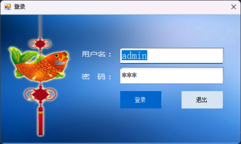
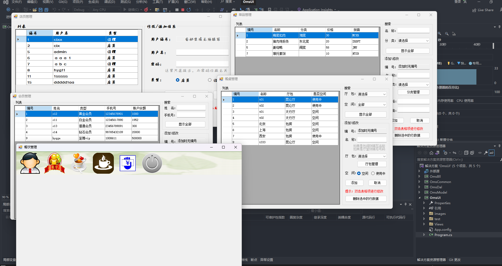
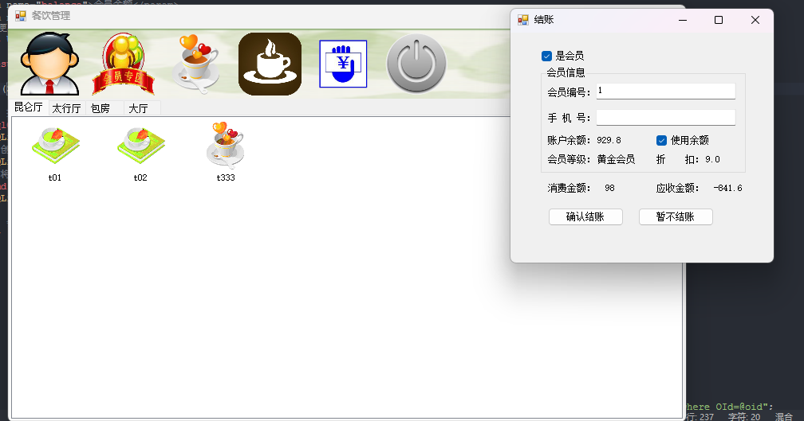

# 项目列表

以下是winform练习项目

## 餐饮管理系统

项目文件夹：**OrderingManagementSystem**
> 针对饭店管理系统，用户分为经理和店员，模块有店员管理、会员管理、餐桌管理、菜单管理、结账管理

数据库：sqlite 在dal模块下db文件夹下，**使用前需要修改UI模块的App.config数据库路径配置**。

项目图片展示：

一个桌位代表一个订单，当订单结账后才算桌位空闲。(菜单中菜品数量未控制)

桌位下单逻辑：

- 下单操作：双击桌子后下单占桌位，后显示点菜窗口。（订单表插入一条记录-》修改桌位状态-》返回订单id）
- 已下单加菜：双击桌子查询当前桌子未结账的订单id，后显示点菜窗口，继续点菜。

点菜逻辑：双击菜单某菜，菜品不存在保存订单详情表插入一条记录，菜品存在根据订单id和菜品id找到记录数量+1 。

结账功能：

- 使用会员折扣结账
  - 使用余额结账
  - 不使用
- 普通结账

难点：下单点菜功能和结账功能。

总结：

1. 对桌面项目和winform组件的熟悉。
2. 应用项目架构熟悉MVC模式三层架构，分为 **UI、Bll、Dal**、Model、Common。
3. 熟悉C#中ado 操作数据库的crud，通用文件 **SqliteHelper.cs**。
4. 熟悉一下npoi导出execl，参考 [使用NPOI进行Excel数据的导入导出 - springsnow - 博客园 (cnblogs.com)](https://www.cnblogs.com/springsnow/p/13123912.html)

